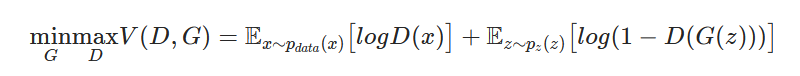
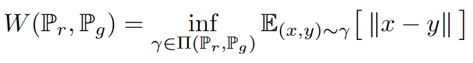
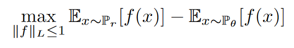
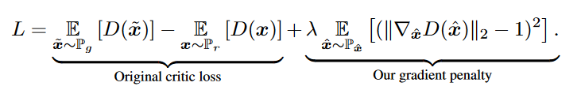
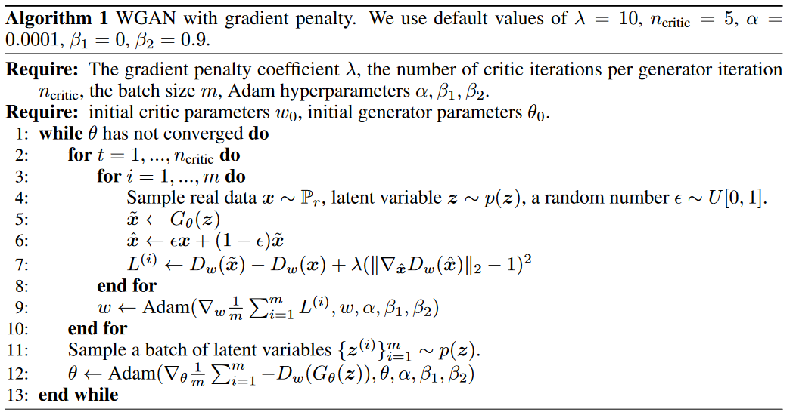

# Animated Face Creation using Generative Adversarial Networks

## A Computer Vision by Deep Learning Study

<u>Group 24</u> -  **Frans de Boer**, **Jonathan Borg**, **Haoran Xia**

Original Paper: [https://arxiv.org/abs/1708.05509](https://arxiv.org/abs/1708.05509)

[//]: # "Differences:"
[//]: # "Images are set to a resolution of 96x96 - theirs was 128x128"

---

## Introduction

Generative adversarial networks (GAN) are composed of two primary components, the generator, a neural network tasked with generating images appearing to be as 'real' as possible, and the discriminator, another neural network charged with determining if the supplied image is real or fake (i.e., generated by the other network). These two networks compete against each other to form a [zero-sum game](https://en.wikipedia.org/wiki/Zero-sum_game), where one agent's gain is another agent's loss.

Following the advancements of GANs in several fields, we decided to implement a model capable of generating animated faces. Even though such research is not new, as shown by Y. Jin\cite{jin2017towards}, we believe that different model architectures can yield stronger results.

Apart from the model generation, ample tests, such as different model architectures and different datasets with diverse animation styles, were carried out to develop a robust and stable model. This allowed us to compare how our model would scale against other research, such as the benchmark model supplied by Y. Zheng\cite{zheng2020cartoon}.

Therefore, we set out to create a GAN capable of generating animated faces based on the data set provided during training (usually specific to a particular style of drawing - cartoon or anime). In the following sections, we illustrate and explain how this was set up, the architectures used, and different data supplied—followed by all the experiments carried out to evaluate and compare our model.

---

## Technical details & Background
[//]: # "Maybe a section about convolutions? -Would it be needed for our research?"

### GANs
Our implemented models are all based on the GAN\cite{goodfellow2014generative} architecture. GANs are types of frameworks used for learning the training data's distribution such that new data can be generated from learned distribution. 

A GAN consists of two key components, a **generator** and a **discriminator**. The generator is tasked with generating 'fake' data (images) that look similar to the real (training) images, while the discriminator tries to classify an image as either real or fake (generated). 
These two components are trained in an adversarial way such that the generator tries to 'outsmart' the discriminator by generating more realistic 'fake' images, while the discriminator tries to better classify whether its given input is real or fake. 

This adversarial way of training continues until an equilibrium is achieved where the generator can create perfect fakes. That is, the discriminator can only guess whether some input is real or fake (50% confidence in its classifications). 
 

###GAN Training 
As previously mentioned, the generator and discriminator are trained jointly within a GAN. The loss function is as follows:

Where $D(x)$ is the discriminator, and $G(x)$ is the generator. $D(G(x))$ is the probability that the output of generator $G()$ is a real image. 

The discriminator and the generator play a minimax game where the discriminator tries to maximize the probability of classifying real and fake images correctly. In contrast, the generator minimizes the likelihood that the discriminator classifies the generated data as fake. 

---

## Method & Approach

Within the following section, we describe the type of data used, methods utilized, and the different components of each architecture.

###Data

Within this subsection, we discuss the type of data being used, alongside the pre-processing required such that this data can be used within the model.

####Dataset

Seeing as the inspiration for this type of research was obtained from a paper conducting the same kind of research\cite{jin2017towards}, we opted to use their original data source. Unfortunately, when trying to replicate their data retrieval process, our team could not generate the dataset successfully. Therefore we found a similar \href{https://drive.google.com/file/d/1HG7YnakUkjaxtNMclbl2t5sJwGLcHYsI/view}{dataset}, containing approximately 30 thousand anime faces.

We also looked into different datasets, expressly, different animation styles, such as cartoon faces, apart from this primary dataset. However, as discussed in the Evaluation section, this secondary dataset was used as part of our evaluation to understand how our model would perform when using different animation styles.
 

####Data pre-processing

Before training and evaluating our models, all training and testing validation data sets are modified to a resolution of 96x96. This alteration allows for a uniform model architecture for all training. Nevertheless, even though we are applying this pre-processing, our algorithm is strong enough to cater to different resolution values by slightly altering the model architecture to cater to these new resolutions.

####Data Augmentation

To reduce the data bias and overfitting and obtain more versatility in our data, for each epoch, we deploy a horizontal flip on an image; each image has a probability of 0.5 of being flipped or keeping the original.

[//]: # " Maybe explicitly mention what are the parameters?"

###Models
Within this subsection, we discuss the models used and their respective loss functions.

[//]: # "####Different Models"
GANs are known to be challenging to train. That is why different types of GANs exist to combat the problems such as mode collapse and improve training stability. For our project, we decided to start with a basic DCGAN \cite{dcganpaper_radford2015unsupervised} (Deep Convolutional GAN). 
When comparing regular GANs and DCGANs, one can note that DCGANs explicitly use Convolutional layers, while regular GANs use fully connected layers. This puts our initial model at an advantage since convolutional layers have been shown to be very successful in image-related tasks.

However, during training, we noticed that our DCGAN encountered the issue of [mode collapse](https://developers.google.com/machine-learning/gan/problems\#mode-collapse) after a short amount of epochs. This led us to research different GAN architectures that can combat the issue of mode collapse. As a result, we found the architecture called the Wasserstein GAN (WGAN)\cite{arjovsky2017wasserstein}, and an extension called Wasserstein GAN with Gradient Penalty (WGAN-GP)\cite{gulrajani2017improved}. This architecture showed to solve the problem of mode collapse, with the pitfall of requiring more training before acceptable results could be identified.

####DCGAN
A DCGAN is an extension of the GAN architecture that uses only convolutional (and convolutional-transpose) layers in each component. For our research, we followed the original DCGAN paper guidelines\cite{dcganpaper_radford2015unsupervised} with the slight adjustment of altering the number of network layers. 

The **Discriminator** is composed of strided convolutional layers, batch normalization layers, and {LeakyReLU}(https://paperswithcode.com/method/leaky-relu) activation functions. The input to the discriminator is an image ${3 \times W \times H}$, and this network outputs a scalar probability, indicating if the input was real. 

The **Generator** consists of convolutional-transpose layers, batch normalization layers, and ReLU activation functions. It takes as input a latent vector z (of Gaussian noise) and outputs a $3 \times W \times H$ (RGB) image. 

For **Weight initialization** of our models we follow the guidelines as described in the DCGAN \cite{dcganpaper_radford2015unsupervised}. This means that all weights are randomly initialized with a ${mean = 0}$ and ${standard~deviation(stdev)=0.02}$. 

In terms of **Loss Function**, the [**Binary Cross Entropy** (BCELoss)](https://pytorch.org/docs/stable/generated/torch.nn.BCELoss.html\#bceloss) is used. And we opted to use the **Adam** optimizer, as specified in the DCGAN paper.

####Wasserstein GAN (with Gradient Penalty)
A common problem in regular GANs (and also DCGANs) are **vanishing gradients** and **[mode collapse](https://developers.google.com/machine-learning/gan/problems)**. Vanishing gradients may occur when the discriminator is better equipped and more accurate in its predictions, resulting in the failure of generator training. Mode collapse happens when the generator gets stuck, producing some especially plausible results. This means that it learns only to produce that output, whereas, in an idealistic scenario, this network learns to produce multiple representations that are all plausible to the discriminator.

#####Wasserstein GAN

The Wasserstein GAN is capable of solving both previously mentioned issues. This GAN allows for the training of the discriminator optimally without worrying about vanishing gradients. To achieve this, we use the Wasserstein Loss, which aims to minimize the Wasserstein distance (Earth-Mover distance) between two distributions: the training samples and the generated examples. Formally defined as:

The Wasserstein distance has a continuous and differentiable gradient property explicitly even after the discriminator (also known as a critic when using WGANs) is well trained. This continuous and differentiable gradient property alleviates the problem of mode collapse \ref{TODO: REF SOME BLOGPOSTS?}.

Because the original equation for the Wasserstein distance is intractable to compute, the authors used the Kantorovich-Rubinstein duality to simplify the calculation to the following:

Where ${f(x)}$ is the **critic (discriminator)** and the ${x}$'s are sampled from two distributions namely the training distribution ${P_r}$ and the generator $P_\theta$.

[//]: # "Should this be a footnote or kept as an easy-to-read paragraph?"
The discriminator is named critic because the critic $f$ does not classify (or discriminate) but instead evaluates how 'real' some input is (criticizing the output). With respect to the loss expression, we are now checking how close the **distance** is between samples from $P_r$ and $P_\theta$, hence the so-called critic.

Finally, we have a **constraint (Lipschitz constraint)** $||f||_L \leq 1$, representing that the norm of the gradient of $f$ must be less than or equal to 1.

This loss can be interpreted as the discriminator trying to maximize this expression, meaning that it wants to separate the two distributions $P_r$ and $P_\theta$ as much as possible, while the generator aims to minimize it. 

#####Wasserstein GAN with Gradient Penalty

In the original WGAN paper, the Lipschitz constraint is enforced by separately clipping each of the weights such that the gradient norm stays less or equal to 1. However, the authors mention that this is a bad idea~\cite{paper?}, allowing them to research this in more detail in future research. That is Wasserstein GAN with Gradient Penalty, abbreviated to WGAN-GP~\cite{gulrajani2017improved}.

**Gradient Penalty** is an alternative to weight clipping to enforce the Lipschitz constraint. Instead of clipping weights, the authors directly constrain the gradient norm of the critic's output with respect to its input. This is obtained by adding a (gradient) penalty term to the Wasserstein Loss:

The paper proved that points interpolated between the real and generated data should have a gradient norm of 1 for $f$. This is then used to enforce the Lipschitz constraint by ensuring that the gradients' norm stays less or equal to 1. 

A slightly more elaborate explanation; (interpolated images) $\hat{x}$'s are sampled from $P_{\hat{x}}$ which are points between $P_g$ (generated images) and $P_r$ (real images) as they lie in between the real and generated data. To minimize this loss, the penalty term must be minimized as well, and this only happens when the penalty term approaches 0 or when $||\nabla_{\hat{x}} D(\hat{x})||_2$, the norm of the gradient of the interpolated image, is close to 1 which will enforce the Lipschitz constraint. To enforce the Lipschitz constraint, we must thus make sure that the gradient norm of the interpolation is close to 1. If this is not the case, we penalize the model so that it learns to satisfy this constraint.

#####Implementation changes

To implement and transform the original DCGAN into a WGAN-GP, we can follow the pseudocode as proposed by the authors. 

The authors first propose that the critic be trained five times as much as the generator. Secondly, we compute the penalty term as described in the loss. In the original WGAN paper, RMSprop was used as an optimizer. However, WGAN-GP uses Adam again (what we implemented within our model). Finally, we adjust our models by removing the Sigmoid activation in our final layer of the critic and changing the BatchNorm layers to InstanceNorm layers in the critic. 

[//]: # " TODO: Changes as opposed to DCGAN in terms of implementation"
[//]: # "RMSprop instead of ADAM, train discriminator more than generator, different normalization, slightly different architecture linear instead of sigmoid activation in last layer)"

---

## Experiments & Results

### Architecture Change

### Data Set Selection

### Epoch Selection

#### Testing curve results

---

## Discussion

---

## Future Work

## Conclusion

---

## References

[1] Jin, Y., Zhang, J., Li, M., Tian, Y., Zhu, H., & Fang, Z. (2017). Towards the automatic anime characters creation with generative adversarial networks. arXiv preprint arXiv:1708.05509.
