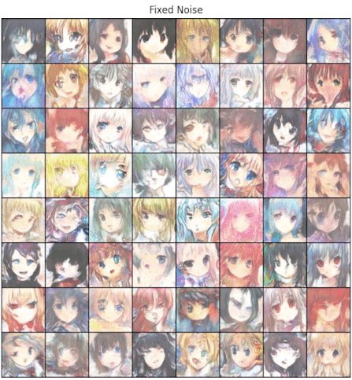
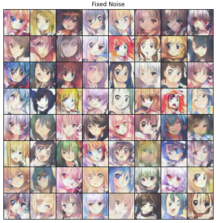

# Animated Face Creation using Generative Adversarial Networks

## A Computer Vision by Deep Learning Study 

<u>Group 24</u> -  **Frans de Boer**, **Haoran Xia**, **Jonathan Borg**

Please feel free to view the [poster here](Images/CVDL%20Poster.pdf).

[//]: # "Original Paper: [https://arxiv.org/abs/1708.05509](https://arxiv.org/abs/1708.05509)"

---

 Data | DCGAN | WGAN
:---:|:-------------------------:|:-------------------------:
No Augmentation |  | 
Horizontal Flip |  | 

---

||
|:---:|
|Interpolation between 2 random noise vectors|

---

## Introduction

Generative adversarial networks (GAN) are composed of two primary components, the generator, a neural network tasked with generating images appearing to be as 'real' as possible, and the discriminator, another neural network charged with determining if the supplied image is real or fake (i.e., generated by the other network). These two networks compete against each other to form a [zero-sum game](https://en.wikipedia.org/wiki/Zero-sum_game), where one agent's gain is another agent's loss.

Following the advancements of GANs in several fields, we decided to implement a model capable of generating animated faces. Even though such research is not new, as shown by the research "Towards the Automatic Anime Characters Creation with Generative Adversarial Networks" by Y. Jin et.al [1], we believe that different model architectures can yield stronger results.

Apart from the model generation, ample tests, such as different model architectures and different datasets with diverse animation styles, were conducted to develop a robust and stable model.

Therefore, we set out to create a GAN capable of generating animated faces based on the data set provided during training (usually specific to a particular drawing style - cartoon or anime). In the following sections, we illustrate and explain how this was set up, the architectures used, and the data supplied—followed by all the experiments to evaluate and compare our model.

---

## Technical Background

### GANs

Our implemented models are all based on the GAN [2] architecture. GANs are frameworks used for learning the training data's distribution such that new data can be generated from learned distribution. 

A GAN consists of two key components, a **generator** and a **discriminator**. The generator is tasked with generating 'fake' data (images) that look similar to the real (training) images, while the discriminator tries to classify an image as either real or fake (generated). 
These two components are trained in an adversarial way such that the generator tries to 'outsmart' the discriminator by generating more realistic 'fake' images, while the discriminator tries to better classify whether its given input is real or fake. 

This adversarial way of training continues until an equilibrium is achieved where the generator can create perfect fakes. That is, the discriminator can only guess whether some input is real or fake (50% confidence in its classifications). 
 

### GAN Training

As previously mentioned, the generator and discriminator are trained jointly within a GAN. The loss function is as follows:

Where ${D(x)}$ is the discriminator, and ${G(x)}$ is the generator. ${D(G(x))}$ is the probability that the output of generator ${G(z)}$ is a real image, where $z$ is a noise vector. 

The discriminator and the generator play a minimax game where the discriminator tries to maximize the probability of classifying real and fake images correctly. In contrast, the generator minimizes the likelihood that the discriminator classifies the generated data as fake. 

## Method & Approach

Within the following section, we describe the type of data used, methods utilized, and the different components of each architecture.

### Data

Within this subsection, we discuss the type of data being used, alongside the pre-processing required such that this data can be used within the model.

#### Dataset

Seeing as the inspiration for this type of research was obtained from a paper conducting the same kind of research [1], we opted to use their original data source. Unfortunately, our team could not generate the dataset successfully when trying to replicate their data retrieval process. Therefore we found a similar [dataset](https://drive.google.com/file/d/1HG7YnakUkjaxtNMclbl2t5sJwGLcHYsI/view), containing approximately 30 thousand anime faces.

We also looked into different datasets, expressly, different animation styles, such as cartoon faces, apart from this primary dataset. However, after evaluating and training the network on these datasets, we opted to omit this from our research.

The Google Cartoon [dataset](https://google.github.io/cartoonset/), it became evident that the network gains were negligible, mainly because all faces are very structured and well oriented, therefore as shown in Appendix A.

Another dataset considered was the iCartoon [3] dataset. Even though this was very robust, we struggled to obtain a large enough dataset which followed a similar artistic style. The biggest problem was that this dataset only provided approximately 100 images per character, which posed a problem due to the large variability in the dataset, where images ranged from hand-drawn faces to live animations.

#### Data pre-processing

Before training and evaluating our models, all training and testing validation data sets are modified to a resolution of 96x96. This alteration allows for a uniform model architecture for all training. Nevertheless, even though we are applying this pre-processing, our algorithm is strong enough to cater to different resolution values by slightly altering the model architecture to cater to these new resolutions.

#### Data Augmentation

To reduce the data bias and overfitting and obtain more versatility in our data, for each epoch, we deploy a horizontal flip on an image; each image has a probability of 0.5 of being flipped or keeping the original.

### Models
Within this subsection, we discuss the models used and their respective loss functions.

GANs are known to be challenging to train. That is why different types of GANs exist to combat the problems such as mode collapse and improve training stability. For our project, we decided to start with a basic DCGAN [4] (Deep Convolutional GAN). 
When comparing regular GANs and DCGANs, one can note that DCGANs explicitly use Convolutional layers, while regular GANs use fully connected layers. This gives our initial model an advantage since convolutional layers have been shown to be very successful in image-related tasks.

However, during training, we noticed that our DCGAN encountered the issue of [mode collapse](https://developers.google.com/machine-learning/gan/problems\#mode-collapse) after a short amount of epochs. This led us to research different GAN architectures that can combat the issue of mode collapse. As a result, we found the architecture called the Wasserstein GAN (WGAN) [5], and an extension called Wasserstein GAN with Gradient Penalty (WGAN-GP) [6]. This architecture showed to solve the problem of mode collapse, with the pitfall of requiring more training before acceptable results could be identified.

#### DCGAN
A DCGAN is an extension of the GAN architecture that uses only convolutional (and convolutional-transpose) layers in each component. For our research, we followed the original DCGAN paper guidelines [4] with the slight adjustment of altering the number of network layers. 

The **Discriminator** is composed of strided convolutional layers, batch normalization layers, and [LeakyReLU](https://paperswithcode.com/method/leaky-relu) activation functions. The input to the discriminator is an image ${3 \times W \times H}$, and this network outputs a scalar probability, indicating if the input was real. 

The **Generator** consists of convolutional-transpose layers, batch normalization layers, and ReLU activation functions. It takes as input a latent vector z (of Gaussian noise) and outputs a $3 \times W \times H$ (RGB) image. 

For **Weight initialization** of our models we follow the guidelines as described in the DCGAN [4]. This means that all weights are randomly initialized with a ${mean = 0}$ and ${standard~deviation(stdev)=0.02}$. 

In terms of **Loss Function**, the [**Binary Cross Entropy (BCELoss)**](https://pytorch.org/docs/stable/generated/torch.nn.BCELoss.html\#bceloss) is used. And we opted to use the **Adam** optimizer, as specified in the DCGAN paper.

|  |
|:---:|
| Figure 1: Architecture of DGCAN. Top - Generator, Bottom - Discriminator |

#### Wasserstein GAN (with Gradient Penalty)

A common problem in regular GANs (and also DCGANs) are **vanishing gradients** and [**mode collapse**](https://developers.google.com/machine-learning/gan/problems). Vanishing gradients may occur when the discriminator is better equipped and more accurate in its predictions, resulting in the failure of generator training. Mode collapse happens when the generator gets stuck, producing some especially plausible results. This means that it learns only to produce that output, whereas, in an idealistic scenario, this network learns to produce multiple representations that are all plausible to the discriminator.

|  |
|:---:|
| Figure 2: Architecture of WGAN. Top - Generator, Bottom - Discriminator |

##### Wasserstein GAN

The Wasserstein GAN is capable of solving both previously mentioned issues. Furthermore, this GAN allows the discriminator's training optimally without worrying about vanishing gradients. To achieve this, we use the Wasserstein Loss, which aims to minimize the Wasserstein distance (Earth-Mover distance) between two distributions: the training samples and the generated examples. Formally defined as:

The Wasserstein distance explicitly has a continuous and differentiable gradient property even after the discriminator (also known as a critic when using WGANs) is well trained. This continuous and differentiable gradient property alleviates the problem of [mode collapse](https://developers.google.com/machine-learning/gan/problems).

Because the original equation for the Wasserstein distance is intractable to compute, the authors used the Kantorovich-Rubinstein duality to simplify the calculation to the following:

Where ${f(x)}$ is the **critic (discriminator)** and the ${x}$'s are sampled from two distributions namely the training distribution ${P_r}$ and the generator $P_\theta$.

The discriminator is named critic because the critic $f$ does not classify (or discriminate) but instead evaluates how 'real' some input is (criticizing the output). With respect to the loss expression, we are now checking how close the **distance** is between samples from $P_r$ and $P_\theta$, hence the so-called critic.

Finally, we have a **constraint (Lipschitz constraint)** $\|f\|_L \leq 1$, representing that the norm of the gradient of $f$ must be less than or equal to 1.

This loss can be interpreted as the discriminator trying to maximize this expression, meaning that it wants to separate the two distributions $P_r$ and $P_\theta$ as much as possible, while the generator aims to minimize it. 

##### Wasserstein GAN with Gradient Penalty

In the original WGAN paper, the Lipschitz constraint is enforced by separately clipping each of the weights such that the gradient norm stays less or equal to 1.  However, the authors mention that this is a bad idea [5], they proposed future work to research this more thoroughly. As a consequence, Wasserstein GAN with Gradient Penalty (WGAN-GP) [6] was introduced.

**Gradient Penalty** is an alternative to weight clipping to enforce the Lipschitz constraint. Instead of clipping weights, the authors directly constrain the gradient norm of the critic's output with respect to its input. This is obtained by adding a (gradient) penalty term to the Wasserstein Loss:

The paper proved that points interpolated between the real and generated data should have a gradient norm of 1 for $f$. This is then used to enforce the Lipschitz constraint by ensuring that the gradients' norm stays less or equal to 1. 

A slightly more elaborate explanation; (interpolated images) $\hat{x}$'s are sampled from $P_{\hat{x}}$ which are points between $P_g$ (generated images) and $P_r$ (real images) as they lie in between the real and generated data. To minimize this loss, the penalty term must be minimized as well, and this only happens when the penalty term approaches 0 or when $\|\nabla_{\hat{x}} D(\hat{x})\|_2$, the norm of the gradient of the interpolated image, is close to 1 which will enforce the Lipschitz constraint. If this is not the case, we penalize the model so that it learns to satisfy this constraint.

##### Implementation changes

To implement and transform the original DCGAN into a WGAN-GP, we can follow the pseudocode as proposed by the authors. 

The authors first propose that the critic be trained five times as much as the generator. Secondly, we compute the penalty term as described in the loss. In the original WGAN paper, RMSprop was used as an optimizer. However, WGAN-GP uses Adam again (what we implemented within our model). Finally, we adjust our models by removing the Sigmoid activation in our final layer of the critic and changing the BatchNorm layers to InstanceNorm layers in the critic.

---

## Experiments \& Results

As for evaluation metrics, we decided to use the Frechet Inception Distance (FID), which measures the quality of images created by a generative model. Unlike the inception score (IS), which evaluates only the distribution of generated images, the FID compares the distribution of generated images with the distribution of real images that were used to train the generator. 

The FID metric is the squared Wasserstein metric between two multidimensional Gaussian distributions:
$\mathcal{N}(\mu ,\Sigma)$ $\mathcal{N}(\mu ,\Sigma)$, the distribution of some neural network features of the images generated by the GAN and $\mathcal{N}(\mu_{w},\Sigma_{w})$ $\mathcal{N}(\mu_{w},\Sigma_{w})$ the distribution of the same neural network features from the real images used to train the GAN.

Mathematically this can be written as $\mathcal{FID}=\|\mu -\mu_{w}\|^{2}\_{2} + \mathcal{tr}(\Sigma + \Sigma\_{w} - 2(\Sigma^{\frac{1}{2}} \Sigma_{w} \Sigma^{\frac{1}{2}})^{\frac{1}{2}})$

Instead of pixel-per-pixel comparison, FID compares the mean and standard deviation of one of the deeper layers in a convolutional neural network named Inception v3.

|  |
|:---:|
| Figure 3: FID values of GANs |

We split our tests into two sections based on the model used, either DCGAN or WGAN. We then further split this up into two sections based on if data augmentation was used or not. The FID scores of each GAN can be seen in Figure 3. These FID scores were calculated after all the model checkpoints were saved and were calculated using the same noise vectors per model (the noise vector was different between the models). Images were saved every ten epochs, and we chose the epoch with the to us best-looking images (guided by the FID scores) as our final results.

### DCGAN Without Data Augmentation

|  |
|:---:|
| Figure 4: DCGAN Without Data Augmentation - 60 Epochs |

Figure 4 shows the results for DCGAN after 60 epochs. Starting from this epoch, the model almost immediately collapsed, and the generator started only to produce random noise. This can also be seen in 3, where after epoch 60, the FID shoots up from a value of about 150 to a value of about 400.

### DCGAN With Data Augmentation

| | | 
|:---:|:---:|
| Figure 5: DCGAN With Data Augmentation - 60 Epochs | Figure 6: DCGAN With Data Augmentation - 90 Epochs |

Figure 5 shows the results for DCGAN with Data Augmentation after 60 epochs. The results here are not noticeably better than the DCGAN results without data augmentation at epoch 60. What is noticeably different, however, is the collapse. Just like DCGAN without augmentation, DCGAN with augmentation starts collapsing after epoch 60. However, the collapse with augmentation is less drastic and still gives results resembling faces at epoch 90 (this can be seen in Figure 6).

### WGAN Without Data Augmentation

|  |
|:---:|
| Figure 7: WGAN Without Data Augmentation - 90 Epochs |

Figure 7 shows the results for WGAN after 90 epochs. Visually inspecting the images, they seem sharper and with fewer artifacts.  
The FID score does not indicate a significant difference between the WGAN at epoch 90 and the DCGANs at epoch 60. What is most noticeable is that the WGAN can keep training even after epoch 60, where both DCGANs started collapsing. Figure 3 does show the FID score going up at epoch 100, but since we stopped training at this point, we can't conclude if it started collapsing or if this was just a random increase due to noise.

### WGAN With Data Augmentation

|  |
|:---:|
| Figure 8: WGAN With Data Augmentation - 100 Epochs |

Figure 8 shows the results for WGAN with Data Augmentation after 100 epochs. The resulting images might be of slightly higher quality, but it is challenging to distinguish clearly between this and WGAN without Data Augmentation. The FID score is slightly lower and also stays lower. This might be the same effect as DCGAN with Data Augmentation, which ended up with an FID score lower than DCGAN without Data Augmentation.

---

## Conclusion

From these results, we can tentatively conclude that WGAN appears to train better than DCGAN. It collapses less and generates higher-quality images than DCGAN. Furthermore, Data Augmentation seems to affect both image quality and FID score positively. However, all of these results are obtained from single runs of the algorithms and could be quite noisy. Following this research, an interesting follow-up would be to investigate the vanishing gradients observed in the DCGAN and understand the cause of this problem.

---

## References

[1] Y. Jin, J. Zhang, M. Li, Y. Tian, H. Zhu, and Z. Fang, “Towards the automatic anime characters creation with generative adversarial networks,” arXiv preprint arXiv:1708.05509, 2017.

[2] Y. Zheng, Y. Zhao, M. Ren, H. Yan, X. Lu, J. Liu, and J. Li, “Cartoon face recognition: A benchmark dataset,” in Proceedings of the 28th ACM international conference on multimedia, 2020, pp. 2264–2272.

[3] I. Goodfellow, J. Pouget-Abadie, M. Mirza, B. Xu, D. Warde-Farley, S. Ozair, A. Courville, and Y. Bengio, “Generative adversarial nets,” Advances in neural information processing systems, vol. 27, 2014.

[4] A. Radford, L. Metz, and S. Chintala, “Unsupervised representation learning with deep convolutional generative adversarial networks,” arXiv preprint arXiv:1511.06434, 2015.

[5] M. Arjovsky, S. Chintala, and L. Bottou, “Wasserstein generative adversarial networks,” in International conference on machine learning. PMLR, 2017, pp. 214–223.

[6] I. Gulrajani, F. Ahmed, M. Arjovsky, V. Dumoulin, and A. C. Courville, “Improved training of wasserstein gans,” Advances in neural information processing systems, vol. 30, 2017. 8

---

## Appendix A - Different Data

||
|:---:|
|Figure 9: Google cartoon dataset - Faces generated at epoch 20|

